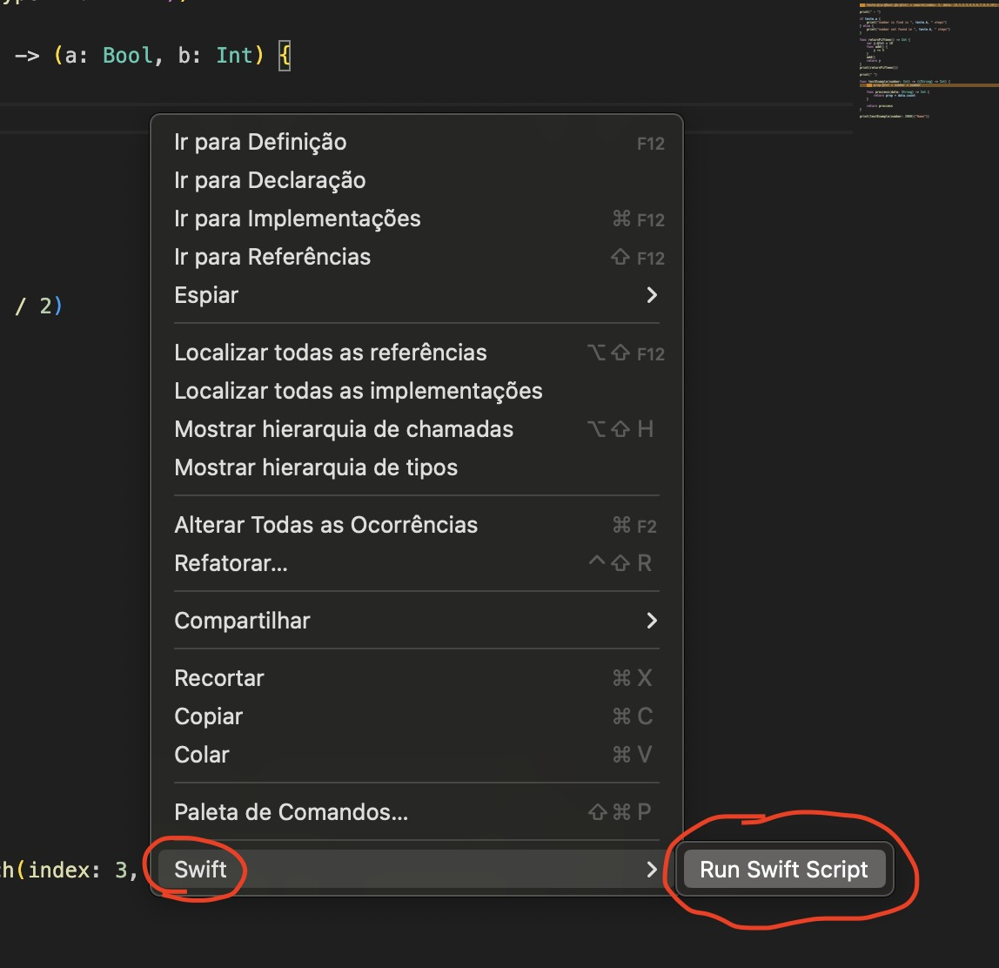

# swift-journey

This repository, i going show my jorney to learning language swift to on future next learn how create iOS app.

Documentation reference: [swift book](https://docs.swift.org/swift-book/documentation/the-swift-programming-language/guidedtour)

## How run swift in vscode ?
use extension **Swift Language Support** to run file script swift.

## File reference
|file|doc|
| --- | --- |
| [Basic](./the_basics.swift) | [Content documentation]() |
| [Objects/Classes](./objects_and_classes.swift) | [Content documentation]() |
| [Functions/Closure](./functions_and_clousure.swift) | [Content documentation]() |
| [Enumerations/Structres](./enumerations_and_structures.swift) | [Content documentation]() |
| [Concurrency](./concurrency.swift) | [Content documentation]() |
| [Protocols/Extensions](./protocols_and_extensions.swift) | [Content documentation]() |